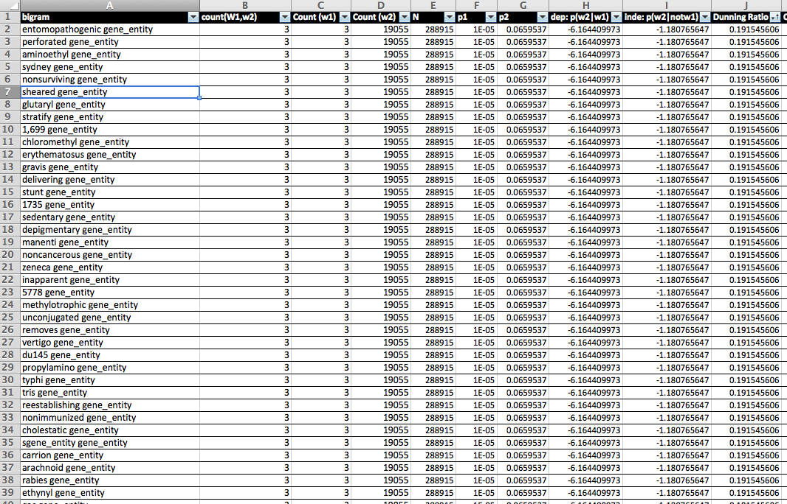
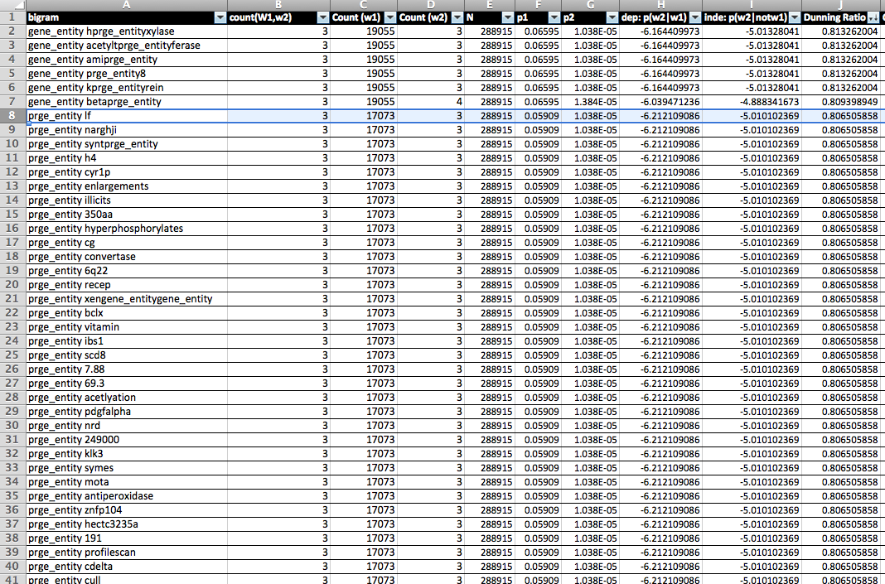
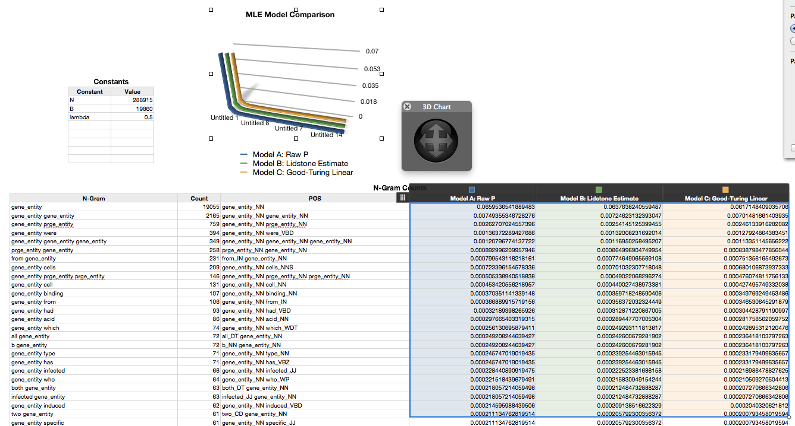
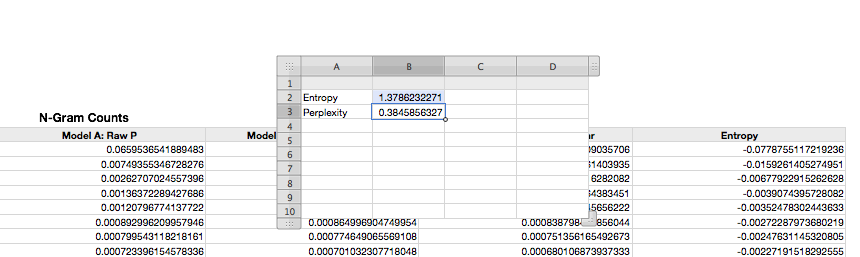

Title:	BMI 591 - Lab 2
Author:	Preston Lee <preston@asu.edu>

# BMI 591 - Lab 2

**By Preston Lee, Fall 2013**

I completed the first lab in Ruby, but decided to switch to Java for this lab after having issues binding to the stanford core NLP .jar. The contents of this lab are packaged as a Maven project under an MIT licensed and are available on [my GitHub page](https://github.com/preston/bmi591/tree/master/lab2). I wrote all the code and ran the experiments for this lab, and exchanged information regarding the analysis portion with Lara Johnstun.

## Part 1 ##

I pulled the DTDs from https://www.ebi.ac.uk/Rebholz-srv/CALBC/dtd/ and wrote a SAX parser by extending the standard event-based org.xml.sax.helpers.DocumentHandler, as is typical for large document parsers to avoid needing to create a massive DOM in memory. The parser finds each sentence ('s' element) within every AbstractText element and replaces each "e" element with only the id of the element, and writing each sentence to an output file along the way. The event-driven nature of SAX provides an O(1) memory complexity regardless of the input file size. The parser also outputs some basic statistics. For the entire data set, the output is:

	Parsing:		/Users/preston/Downloads/calbc_dtds_01-12-10/175k-allcomer-xtype
	Writing:		/Users/preston/Downloads/calbc_dtds_01-12-10/175k-allcomer-xtype.sentences.txt
	10000 abstracts parsed...
	20000 abstracts parsed...
	30000 abstracts parsed...
	40000 abstracts parsed...
	50000 abstracts parsed...
	60000 abstracts parsed...
	70000 abstracts parsed...
	80000 abstracts parsed...
	90000 abstracts parsed...
	100000 abstracts parsed...
	110000 abstracts parsed...
	Abstracts parsed:	118438
	Sentences written:	911400
	Done!

Note that the parser has identified 911,400 distinct sentences in the entire data set, and takes about 30 seconds to run, which includes writing the output to a text file with one sentence per line. When run on a 10% data subset for training, the output is:

	Parsing:		/Users/preston/Downloads/calbc_dtds_01-12-10/175k-allcomer-xtype.test
	Writing:		/Users/preston/Downloads/calbc_dtds_01-12-10/175k-allcomer-xtype.test.sentences.txt
	10000 abstracts parsed...
	Abstracts parsed:	13097
	Sentences written:	114244
	Done!
 
All ***'e'*** entities with ct=".*prge.*" were replaced with the literal "PRGE_ENTITY", and all other remaining ***'e'*** entities with "GENE_ENTITY".

## Part 2 ##

In order to work within available resources, I took 15,000 sentences near the beginning of the complete data set as training data, and other 15,000 as validation. Given more computational cores it would ideally be around the 115,000 sentences for each, which would represent about 10% for training and additional 10% chunks for multiple validation sets, though the smaller ~2% number has provided more than enough data points to complete the assignment. (In the latter sections, though, it was interesting to see the effects.)  All the source code was written to consume near-constant RAM, to allow for for larger data sets to be processed. Based on the estimated completion date for larger data sets, it would not have been computationally plausible to get the results generated on time on my local machine. I used standard/default options of the Stanford tagger when possible, only making changes to speed things up as much as possible.

## Part 3 ##

I started by implementing a basic, single-threaded indexer with inline integration of the Stanford POS tagger using the Document fields and one-pass approach inferred by the assignment text. That is, *id (int), text (String), n (int), pos (String), and count (int)* fields per document, where the count field must be incremented for cases that have already been seen.   Interestingly, the *updateDocument(..)* call provided in Lucene 4.4.0 has different side effects than previous versions, and is problematic which running jobs with mixed CRUD operations. Specifically, *updateDocument(..)* and a subsequent *commit()* on the IndexWriter to *not* properly flush an associated IndexReader and IndexSearcher instances, even when called in blocking mode, though a suitable workaround was found in manually deleting/adding, force committing and flushing to disk, and then reinstantiating the query-related objects.

After resolving the *updateDocument(..)* issue, I added multi-threading to the indexer and refactored into a queued sentence producer/consumer pattern, resolved a few concurrency-related bugs, bumped the max heap size to the maximum my system would reasonably tolerate (2GiB), and ran the indexer with 4 worker threads. The process still took time but actually finished in reasonable time.

## Part 4 ##

After creating the index, I created a QueryIndex class to run the appropriate queries and generate .csv files that I could then load into Excel for manipulation. (See attached Excel workbook.) The Stanford POS tagger marked all PRGE_ENTITY and GENE_ENTITY literals using the NN (noun) tag, which is reflected in very high hit prevelances for both. After looking at the output, and verifying this, I decide to focus on this tag. The top bigrams and t-test statistic calculations are included in the Excel file. Not surprisingly, various permutations of PRGE_ENTITY and GENE_ENTITY top the list by far. Here are the top 20 by highest-ranking t-score value:

| w1 	| w2 	| Count(w1,w2) 	|  Count(w1) 	|  Count(w2) 	|  w1 pos	| pos w2 	|	p(w1) 	|	p(w2)	|  t-stat	|  count t-score diff
| ----	| ----	| --------------	| ------------	| ------------	| --------	| --------	|	------	|	-----	| --------	| --------------------
| prge_entity 	| prge_entity 	| 2229 	| 17073 	| 17073 	| prge_entity_NN 	| prge_entity_NN 	| 0.059093505 	| 0.059093505 	| 25.84277692 	| 2203.157223 	|
| gene_entity 	| gene_entity 	| 2165 	| 19055 	| 19055 	| gene_entity_NN 	| gene_entity_NN 	| 0.065953426 	| 0.065953426 	| 19.52000964 	| 2145.47999 	|
| we 	| have 	| 262 	| 1383 	| 753 	| we_PRP 	| have_VBP 	| 0.004786792 	| 0.002606258 	| 15.96373011 	| 246.0362699 	|
| has 	| been 	| 245 	| 506 	| 529 	| has_VBZ 	| been_VBN 	| 0.001751338 	| 0.001830944 	| 15.59328663 	| 229.4067134 	|
| t 	| cells 	| 226 	| 667 	| 1983 	| t_NN 	| cells_NNS 	| 0.002308558 	| 0.006863373 	| 14.72878102 	| 211.271219 	|
| t 	| cell 	| 190 	| 667 	| 1350 	| t_NN 	| cell_NN 	| 0.002308534 	| 0.004672444 	| 13.5579526 	| 176.4420474 	|
| prge_entity 	| protein 	| 294 	| 17073 	| 1286 	| prge_entity_NN 	| protein_NN 	| 0.059092687 	| 0.004451075 	| 12.71441505 	| 281.285585 	|
| have 	| been 	| 159 	| 753 	| 529 	| have_VBP 	| been_VBN 	| 0.002606177 	| 0.0018309 	| 12.50018477 	| 146.4998152 	|
| cell 	| lines 	| 144 	| 1350 	| 179 	| cell_NN 	| lines_NNS 	| 0.00467238 	| 0.000619523 	| 11.93030367 	| 132.0696963 	|
| gene_entity 	| were 	| 394 	| 19055 	| 2516 	| gene_entity_NN 	| were_VBD 	| 0.065952969 	| 0.008708353 	| 11.48961415 	| 382.5103858 	|
| wild 	| type 	| 121 	| 132 	| 511 	| wild_JJ 	| type_NN 	| 0.000456849 	| 0.001768558 	| 10.97877731 	| 110.0212227 	|
| amino 	| acid 	| 120 	| 249 	| 233 	| amino_NN 	| acid_NN 	| 0.000861777 	| 0.000806401 	| 10.93612125 	| 109.0638787 	|
| were 	| found 	| 120 	| 2516 	| 516 	| were_VBD 	| found_VBN 	| 0.008707781 	| 0.001785856 	| 10.54427863 	| 109.4557214 	|
| here 	| we 	| 112 	| 177 	| 1383 	| here_RB 	| we_PRP 	| 0.000612582 	| 0.004786444 	| 10.50295231 	| 101.4970477 	|
| prge_entity 	| promoter 	| 157 	| 17073 	| 479 	| prge_entity_NN 	| promoter_NN 	| 0.059090437 	| 0.001657841 	| 10.27103348 	| 146.7289665 	|
| p 	| 0.05 	| 105 	| 565 	| 116 	| p_NN 	| 0.05_CD 	| 0.001955389 	| 0.00040146 	| 10.2248149 	| 94.7751851 	|
| cell 	| line 	| 103 	| 1350 	| 138 	| cell_NN 	| line_NN 	| 0.004672137 	| 0.000477596 	| 10.08536198 	| 92.91463802 	|
| we 	| show 	| 102 	| 1383 	| 218 	| we_PRP 	| show_VBP 	| 0.004786328 	| 0.000754461 	| 9.996191005 	| 92.00380899 	|
| protein 	| prge_entity 	| 226 	| 1286 	| 17073 	| protein_NN 	| prge_entity_NN 	| 0.004450997 	| 0.059091664 	| 9.978391698 	| 216.0216083 	|

The difference between t-score and raw count values is dramatic, due to the shear number of entity references in the source material. While many common phrases dominate the top bigram list, a satisfying number are strongly correlated to biomedical literature. 

## Part 5 ##

For the Dunning ratios on GENE_ENTITY bigrams, the top results are as follows:

Similarly for the PRGE_ENTITIES bigrams:

Based on the scores alone it in tempting to assert there are many strong colocations, and ostensibly many probably are. We cannot jump to this conclusion though for bigrams with very infrequent words, as the Dunning ratio alone can skew when used with a frequent tag (such as GENE_ENTITY and PRGE_ENTITY) paired with very infrequent words that just happen to hit 100% of the time in the training set.

## Part 6 ##

I calculated the probabilities of GENE_ENTITY using the three likelihood estimations models and plotted them for comparison, as shown:

The .5 lambda value shown was used as suggestion as a good starting point as a "small value". As you can see by chart of the top most likely n-grams, all three models yield slightly different values but are visually indiscernible in this case. The total number of bins (B) and n-gram counts (N) were determined empirically.

## Part 7 ##

I put the following three short, medium, and long sentences through the tokenizer and calculated the probability for the entire sentences based on the training data as part of my query script, as follows:

	N == 288915
	Sentence: Both these fragments reacted with protein A.
	Probablity: 3.929298779810284E-13
	Sentence: A secondary site near the 5' end ( approximately 10 bases) was also observed.
	Probablity: 1.7093525373623E-33
	Sentence: Binding of FinP to the traJ GENE_ENTITY sequesters the traJ ribosome GENE_ENTITY, preventing its translation and repressing GENE_ENTITY transfer.
	Probablity: 8.569119195530559E-27

Even the smallest sentence is extremely improbable, based on the training data. The longest sentence, even with three occurrances of a very common token, is astronomically improbable. This tells us that, for practical purposes, many human sentences of modest length tend to be unique. This makes finding plagiarism much easier. :)

## Part 8 ##

Cross entropy estimates maximum entropy, which is turn is an estimate of uncertainty. It is useful since, unlike "random" processes, we don't know the true probability of a given part of speech. I followed the wikipedia formula based on the estimates from previous sections and calculated a cross entropy as 1.378 for the GENE_ENTITY model, and 1.202 for the PRGE model, meaning the GENE_ENTITY model is more "chaotic" according to the training data. Perplexity is directly related to cross entropy, as cross entropy is the negative exponent of the perplexity calculation. Based on these numbers, perplexity is 0.3849 and .4347, respectively.

